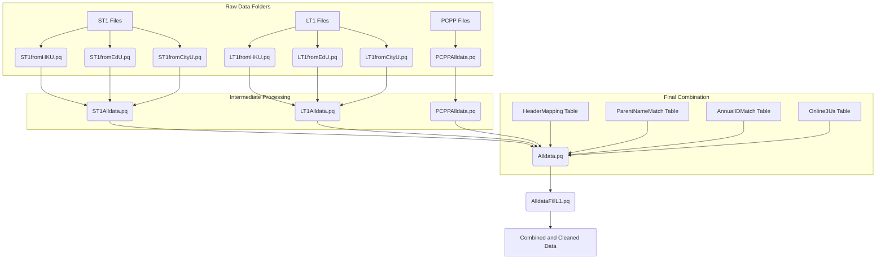

# cityu-ra-project
This directory contains scripts used in faciliating data-preprocessing and analysis.

## Power Query Data Processing: From Individual Files to a Combined Dataset

This project uses Power Query (M language) scripts and some supporting VBA macros to take raw Excel files, clean them up, and combine them into a single, more organized dataset. It's like taking different pieces of information and putting them together in a structured way.

### How the Data Flows:

The process starts with individual Excel files, cleans them, and then brings them together. Here's a simplified view of how the main Power Query scripts connect:

### The Steps Involved:

1.  **Getting the Raw Data (`FolderPath.pq` and individual `fromXXX.pq` files):**
    *   `FolderPath.pq` helps locate the folders where the raw, manually inputted Excel files are stored.
    *   Scripts like `ST1fromHKU.pq`, `ST1fromEdU.pq`, `ST1fromCityU.pq` (and similar for LT1 and PCPP) read these Excel files.
    *   Inside these scripts:
        *   `Excel.Workbook` opens the Excel files.
        *   `Table.PromoteHeaders` makes the first meaningful row into column headers.
        *   `Table.SelectRows` removes empty or irrelevant rows (e.g., those with `#NULL!` or specific text like "ST1\_NO" in the data column).
        *   `Table.TransformColumnTypes` sets the correct data type for each column (e.g., text, date).
        *   Custom logic adds new columns (like `Check_No` or `University` flags) and standardizes existing IDs (e.g., `ST1_SID` is formatted to "S001", "S010", etc.).

2.  **Combining Data from Similar Sources (`ST1Alldata.pq`, `LT1Alldata.pq`, `PCPPAlldata.pq`):**
    *   `ST1Alldata.pq` takes the cleaned data from HKU, EdU, and CityU ST1 files and combines them into one large ST1 table using `Table.Combine`. It also adds a suffix like "_ST1" to the `ST1_NO` column.
    *   `LT1Alldata.pq` does the same for LT1 data, adding "_LT1" to `LT1_NO`.
    *   `PCPPAlldata.pq` processes the PCPP data, adding "_PCPP-PRE1" to `PCPP_PRE1_NO`.

3.  **Bringing Everything Together (`Alldata.pq`):**
    *   This is the central script that combines the ST1, LT1, and PCPP datasets.
    *   It uses a `HeaderMapping` table to rename columns consistently across all datasets (e.g., `ST1_NO`, `LT1_NO`, `PCPP_PRE1_NO` all become `XT1_NO`).
    *   `Table.NestedJoin` is used extensively here to link related information:
        *   It connects ST1 data with `AnnualIDMatch` to get a common `Child ID`.
        *   It then links ST1 data (via `Child ID`) with PCPP data (via `XT1_CID`) to find matching parent-child records.
        *   It also adds school district and group information from the `Online3Us` table.
    *   Columns are removed (`Table.RemoveColumns`) or transformed (`Table.TransformColumns`) as needed to prepare the final structure.
    *   Any blank or null cells are replaced with "#blank" for consistency.

4.  **Final Data Review (`AlldataFillL1.pq`):**
    *   This script takes the combined data from `Alldata.pq`.
    *   It goes through almost every cell and checks if it's empty, null, or contains specific "special numbers" (like 6666, 7777, etc.). If so, it marks that cell as "Unfilled". This helps identify truly missing data.

### Supporting Tools (VBA Macros):

The VBA macros in `compile_data\gpt_tool\` are used within Excel to help prepare or check the raw data files before they are processed by Power Query:
*   `SetValidationByText.bas`: Sets up data validation dropdowns in Excel cells based on values in other cells.
*   `ReplaceIndirectWithDirect.bas`: Converts `INDIRECT` formulas in Excel to direct cell references.
*   `FindAndReplaceTableFormula.bas`: Finds and replaces text within formulas or values in Excel tables.
*   `FindAndReplaceArray.bas`: Finds and replaces text within a specified range of cells in Excel.
*   `ExtractAndDisplayValidation.bas`: Extracts and displays the data validation list formula for cells in a column.

These scripts work together to automate the process of getting data from various sources, cleaning it, and combining it into a single, usable format for further analysis.

## disclaimer
No subject data is available for this script
DataFlow Readme was summarized with AI chatbot.